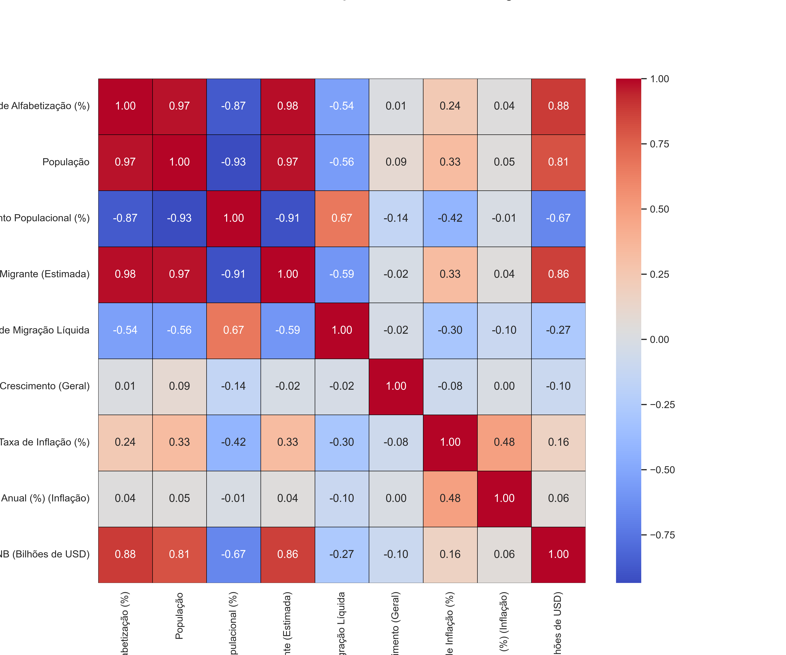
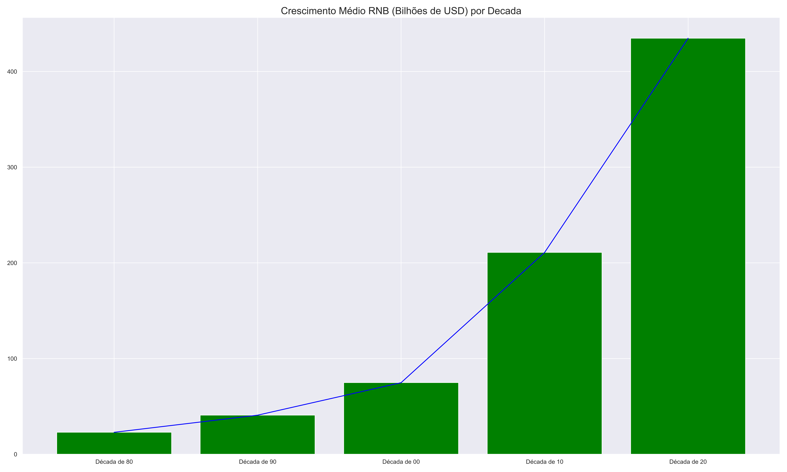
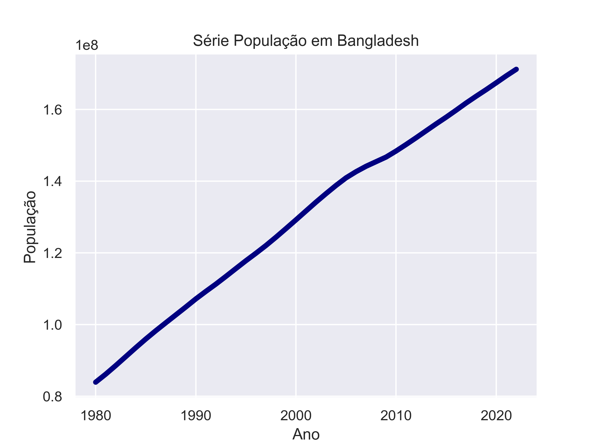

# 📊 Análise de Dados Socioeconômicos — Bangladesh

**Fonte dos Dados:** Indicadores econômicos e sociais de Bangladesh (1980–2023)  
**Ferramentas Utilizadas:** Python (Pandas, Matplotlib, Seaborn, NumPy)

---

## 🧠 Objetivo do Projeto
O objetivo é analisar a evolução das principais variáveis socioeconômicas de Bangladesh — como **alfabetização, população, inflação, RNB e migração líquida** — identificando correlações e tendências históricas.

---

## ⚙️ Etapas Realizadas no Notebook

1. **Importação e tratamento dos dados**  
   - Limpeza de valores nulos e padronização de separadores numéricos.  
   - Conversão de colunas para tipos numéricos coerentes.

2. **Análise exploratória (EDA)**  
   - Cálculo das correlações entre variáveis.  
   - Visualização das distribuições e relações com `pairplot` e `heatmap`.

3. **Análises temporais**  
   - Séries históricas (1980–2023) da **População**, **RNB**, **Taxa de Alfabetização**, **Inflação** e **Migração Líquida**.  
   - Cálculo do crescimento médio da RNB por década.

4. **Visualização e interpretação dos resultados**  
   - Geração de gráficos em alta resolução, salvos em `/fig/`.

---

## 📈 Resultados e Gráficos

| Análise | Figura |
|----------|--------|
| **Matriz de Correlação** |  |
| **Matriz de Dispersão** |  |
| **RNB Médio por Década** |  |
| **Série Populacional** |  |
| **Série RNB (USD)** | .png) |
| **Taxa de Alfabetização** | .png) |
| **Taxa de Inflação** | .png) |
| **Taxa de Migração Líquida** |  |

---

## 🔍 Principais Insights

- **Correlação alta** entre RNB, alfabetização e população, sugerindo desenvolvimento social acompanhado de crescimento econômico.  
- **Inflação instável**, com picos entre 2005 e 2015, mas tendência moderada recente.  
- **Migração líquida negativa**, indicando mais saídas do que entradas no país.  
- **RNB crescente exponencialmente**, especialmente após 2010.  
- **Alfabetização** aumentou consistentemente, ultrapassando 70% após 2020.  

---

## 🧩 Tecnologias Utilizadas

- **Python 3.10+**
- **Jupyter Notebook**
- **Pandas** — manipulação e limpeza de dados  
- **NumPy** — operações numéricas  
- **Matplotlib / Seaborn** — visualização e gráficos  

---

## 🏁 Conclusão

Os dados mostram que Bangladesh experimentou **crescimento econômico expressivo** nas últimas décadas, acompanhado por **melhorias sociais** (alfabetização e qualidade de vida), embora ainda enfrente **desafios migratórios e inflacionários**.  
